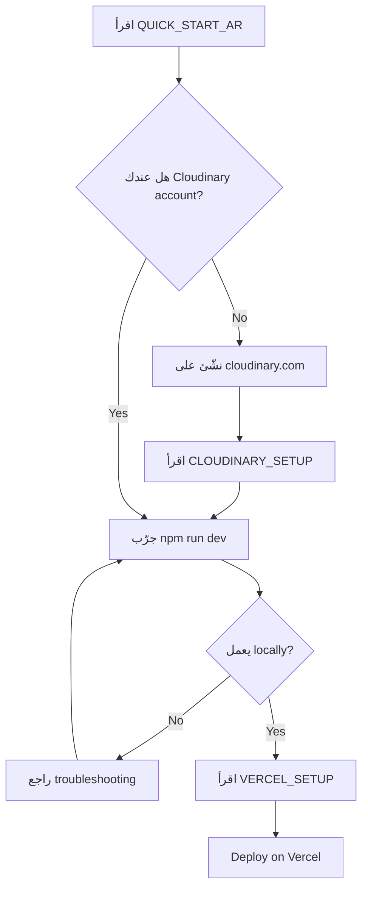

# 📚 Project Documentation Index

## مرحباً بك في المشروع! 👋

هذا مشروع **portfolio serverless** متكامل على **Vercel + Cloudinary**.

---

## 📖 الملفات الأساسية

### للبدء السريع ⚡
- **[QUICK_START_AR.md](./QUICK_START_AR.md)** ← ابدأ هنا! (5 دقائق)
- **[QUICK_START.md](./QUICK_START.md)** ← (English version)

### للإعدادات والـ Setup 🔧
- **[CLOUDINARY_SETUP.md](./CLOUDINARY_SETUP.md)** - إعداد Cloudinary
- **[VERCEL_SETUP.md](./VERCEL_SETUP.md)** - Deploy على Vercel
- **[DEPLOYMENT_CHECKLIST.md](./DEPLOYMENT_CHECKLIST.md)** - قائمة التدقيق

### للتوثيق التقني 🛠️
- **[SERVERLESS_API_README.md](./SERVERLESS_API_README.md)** - توثيق API endpoints
- **[PROJECT_ROADMAP.md](./PROJECT_ROADMAP.md)** - خريطة المشروع والعمارة

### عام 📄
- **[README.md](./README.md)** - النظرة العامة
- **[DEPLOYMENT_GUIDE.md](./DEPLOYMENT_GUIDE.md)** - دليل الـ deployment

---

## 🚀 الخطوات الأولى



---

## 📂 هيكل المشروع

```
project-root/
│
├── 📄 Documentation Files
│   ├── QUICK_START_AR.md          ← ابدأ هنا (عربي)
│   ├── QUICK_START.md             ← (English)
│   ├── CLOUDINARY_SETUP.md        ← إعداد الصور
│   ├── VERCEL_SETUP.md            ← Deploy على الإنترنت
│   ├── PROJECT_ROADMAP.md         ← خريطة المشروع
│   ├── DEPLOYMENT_CHECKLIST.md    ← قائمة التدقيق
│   └── README.md                  ← نظرة عامة
│
├── 🔧 Configuration Files
│   ├── next.config.ts             ← إعدادات Next.js
│   ├── tailwind.config.ts         ← إعدادات Tailwind
│   ├── tsconfig.json              ← إعدادات TypeScript
│   ├── vercel.json                ← إعدادات Vercel
│   ├── package.json               ← المكتبات والأوامر
│   ├── .env.local.example         ← متغيرات بيئية (نموذج)
│   └── .gitignore                 ← ملفات تجاهل Git
│
├── src/
│   ├── app/
│   │   ├── page.tsx               ← الصفحة الرئيسية
│   │   ├── layout.tsx             ← layout عام
│   │   ├── globals.css            ← CSS عام
│   │   ├── admin/                 ← لوحة الإدارة
│   │   ├── login/                 ← صفحة تسجيل الدخول
│   │   ├── privacy/, terms/       ← صفحات ثابتة
│   │   │
│   │   └── api/                   ← API endpoints
│   │       ├── projects/
│   │       │   ├── route.ts       ← GET/POST projects
│   │       │   └── [id]/route.ts  ← GET/PUT/DELETE
│   │       └── upload/
│   │           └── route.ts       ← POST/DELETE images
│   │
│   ├── components/                ← مكونات React
│   │   ├── Navbar.tsx
│   │   ├── Hero.tsx
│   │   ├── Projects.tsx
│   │   ├── ProjectCard.tsx
│   │   ├── ImageUploadInput.tsx   ← مكون رفع الصور ⭐
│   │   ├── Contact.tsx
│   │   └── ui/                    ← مكونات UI
│   │
│   ├── hooks/                     ← React Hooks
│   │   ├── use-image-upload.ts    ← رفع الصور ⭐
│   │   ├── use-projects-api.ts    ← جلب المشاريع
│   │   └── use-mobile.tsx         ← كشف الشاشات
│   │
│   ├── lib/                       ← Utility Functions
│   │   ├── cloudinary-utils.ts    ← دوال Cloudinary ⭐
│   │   ├── utils.ts
│   │   └── project-store.ts
│   │
│   ├── firebase/                  ← Firebase setup
│   │   ├── config.ts
│   │   ├── auth/
│   │   ├── firestore/
│   │   └── provider.tsx
│   │
│   └── data/
│       └── projects.json          ← بيانات تجريبية
│
├── public/
│   └── favicon.ico
│
├── docs/                          ← وثائق إضافية
│   ├── backend.json
│   └── blueprint.md
│
└── 📦 Package Files
    ├── package.json
    ├── package-lock.json / pnpm-lock.yaml
    └── node_modules/ (ignored)
```

---

## 🎯 المميزات الحالية

### ✅ Frontend
- Hero section جميلة
- عرض المشاريع
- صفحات أساسية (About, Contact, Privacy, Terms)
- نموذج إدارة
- تصميم Responsive

### ✅ Backend (Serverless)
- API لجلب المشاريع
- API لرفع الصور
- API لحذف الصور
- معالجة الأخطاء
- التحقق من الإدخال

### ✅ Image Management
- رفع الصور إلى Cloudinary
- تحسين الصور تلقائياً
- حذف الصور
- معاينة قبل الرفع

### ✅ Deployment
- مُهيّئ للـ Vercel
- Serverless functions
- CDN عام للصور
- متغيرات بيئية آمنة

---

## 🔄 Workflow اقتراحي

### Local Development
```bash
npm run dev
# استكشف في http://localhost:3000
# عدّل الكود
# Hot reload تلقائية ✅
```

### Testing
```bash
npm run typecheck  # التحقق من types
npm run lint       # فحص الكود
npm run build      # بناء production
```

### Deployment
```bash
git push  # push to GitHub
# Vercel auto-deploys ✅
# deploy successful? ✅
```

---

## 📝 كيفية استخدام المكونات

### رفع صورة
```tsx
import { ImageUploadInput } from '@/components/ImageUploadInput';

<ImageUploadInput 
  onImageUpload={(url, publicId) => {
    console.log('Uploaded:', url);
  }}
/>
```

### جلب المشاريع
```tsx
import { useProjectsAPI } from '@/hooks/use-projects-api';

const { getProjects } = useProjectsAPI();
const projects = await getProjects();
```

### استخدام Cloudinary URLs
```tsx
import { getCloudinaryUrl } from '@/lib/cloudinary-utils';

const optimizedUrl = getCloudinaryUrl(publicId, {
  width: 400,
  height: 300
});
```

---

## 🐛 استكشاف الأخطاء

| المشكلة | الحل |
|--------|------|
| Dev server لا يعمل | `npm install && npm run dev` |
| صورة لا ترفع | تحقق من CLOUDINARY_CLOUD_NAME |
| 500 error في API | عرّج الـ Vercel logs |
| build failures | `npm run typecheck` للتحقق من الأخطاء |

---

## 📚 مراجع إضافية

### Documentation الرسمية
- [Next.js](https://nextjs.org/docs)
- [Cloudinary](https://cloudinary.com/documentation)
- [Vercel](https://vercel.com/docs)
- [Tailwind CSS](https://tailwindcss.com/docs)

### Tools مفيدة
```bash
# تتبع الملفات المعدّلة
git status

# عرض الـ commit history
git log --oneline

# عرض الأخطاء
npm run typecheck

# بناء والتشغيل محلياً
npm run build && npm run start
```

---

## 🎓 نصائح للمطورين

### بيئة محلية مثالية
```bash
# استخدم .env.local (لا تشاركه)
# استخدم VS Code + ESLint + Prettier extensions
# جرّب Vercel CLI: npm i -g vercel
```

### Best Practices
✅ اكتب TypeScript  
✅ اضف comments للـ complex logic  
✅ اختبر محلياً قبل الـ push  
✅ استخدم meaningful commit messages  
✅ راجع الـ PR قبل الـ merge  

### تحسينات الأداء
✅ استخدم Next.js Image optimization  
✅ Layer صور على Cloudinary  
✅ Code splitting تلقائية  
✅ Cache headers صحيحة  

---

## 🛣️ الخطوات التالية

### اليوم
- ✅ اقرأ QUICK_START_AR
- ✅ شغّل المشروع محلياً
- ✅ اختبر رفع صورة

### هذا الأسبوع
- ✅ اعدّ Vercel account
- ✅ اقرأ VERCEL_SETUP
- ✅ Deploy الأول

### هذا الشهر
- [ ] أضف database integration
- [ ] اكمل API endpoints
- [ ] لوحة تحكم متقدمة

---

## 📞 الدعم

- 💬 راجع [Documentation](.)
- 🐛 ابدأ Issue على GitHub
- 📧 تواصل عبر البريد

---

## 📜 License

اختر license مناسب:
- MIT (شعبي للمشاريع المفتوحة)
- Apache 2.0 (للشركات)
- GPL (للمشاريع التعاونية)

---

## ✨ شكراً!

استمتع بالتطوير! 🚀

**آخر تحديث**: مارس 2026
